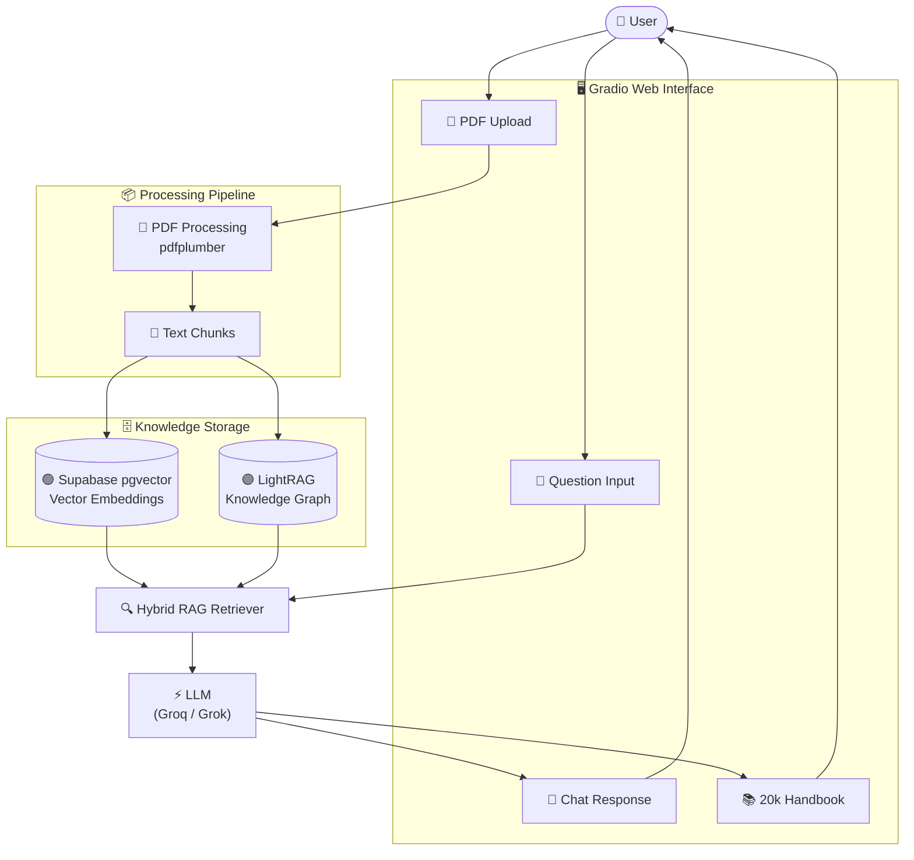

# 🧠 NeuroWeave

> Upload PDFs. Ask questions. Generate 20,000-word handbooks — all through conversation.

---

## 📌 What is NeuroWeave?

NeuroWeave is an AI-powered document intelligence application. Upload your PDF documents, have contextual conversations about the content, and generate comprehensive 20,000+ word structured handbooks — all through a simple chat interface powered by a hybrid Knowledge Graph + Vector Search RAG pipeline.

No complex UI. No manual summarization. Just upload, ask, and generate.

---

## ✨ Core Features

- 📄 **PDF Upload** — Upload one or multiple PDF files directly in the interface
- 💬 **Contextual Chat** — Ask questions and get answers grounded in your uploaded documents
- 📚 **Handbook Generation** — Generate a 20,000+ word structured handbook on any topic in your PDFs
- 🔗 **Knowledge Graph** — LightRAG builds an entity-relationship graph for deep, smart retrieval
- ⚡ **Vector Search** — Supabase pgvector powers fast semantic similarity search
- 📎 **Citations** — Generated handbooks reference content from your uploaded source materials

---

## 🛠️ Tech Stack

| Layer | Technology | Purpose |
|---|---|---|
| **Frontend** | Gradio | Chat interface and PDF upload |
| **PDF Processing** | pdfplumber | Extract and clean text from PDFs |
| **RAG Engine** | LightRAG | Build knowledge graph from document content |
| **Vector Database** | Supabase (pgvector) | Store and retrieve document embeddings |
| **LLM** | Groq (dev) / Grok xAI (recommended) | Power chat responses and handbook generation |
| **Backend** | Python 3.9+ (async/await) | Core application logic |
| **Config** | python-dotenv | Manage API keys and environment variables |

---

## 📁 Project Structure

```
NeuroWeave/
├── app.py                        # 🚀 Main entry point — launches the Gradio UI
├── config.py                     # ⚙️  Loads and validates environment variables
├── requirements.txt              # 📦 Project dependencies
├── .env                          # 🔐 Your API keys (never commit this)
├── .env.example                  # 📋 Template showing required environment variables
├── README.md                     # 📖 Project documentation
│
├── pdf_processing/
│   └── extractor.py              # Handles PDF upload, text extraction and chunking
│
├── rag/
│   ├── lightrag_client.py        # Sets up LightRAG and builds knowledge graph
│   └── retriever.py              # Queries the knowledge graph for relevant context
│
├── database/
│   └── supabase_client.py        # Manages Supabase connection and vector operations
│
├── llm/
│   ├── grok_client.py            # Wrapper for Grok API calls (chat, stream, embed)
│   └── handbook_generator.py     # Orchestrates 20,000-word handbook generation
│
└── utils/
    └── helpers.py                # Shared utilities — text cleaning, chunking
```

---

## 🧠 How Handbook Generation Works

Standard LLMs struggle to generate very long documents in a single pass. NeuroWeave uses the **LongWriter / AgentWrite** technique:

1. **Plan** — Generate a full outline with 10–12 sections, each with a target word count (1,500–2,500 words)
2. **Write** — Generate each section individually using context retrieved from the knowledge graph
3. **Compile** — Assemble all sections into a structured document with a table of contents, executive summary, and references

This produces coherent, well-structured handbooks exceeding 20,000 words.

---

## 🔄 System Architecture



---

## 🔑 Environment Variables

Before running the app, you will need:

| Variable | Required | Description |
|---|---|---|
| `LLM_PROVIDER` | No | `groq` (default) or `grok` — selects which LLM backend to use |
| `GROQ_API_KEY` | When `LLM_PROVIDER=groq` | Free API key from [console.groq.com](https://console.groq.com) |
| `GROK_API_KEY` | When `LLM_PROVIDER=grok` | Paid API key from [console.x.ai](https://console.x.ai) |
| `SUPABASE_URL` | Yes | Your Supabase project URL |
| `SUPABASE_KEY` | Yes | Your Supabase anon/public key |
| `LIGHTRAG_WORKING_DIR` | No | Local folder path for LightRAG graph storage (default: `./lightrag_storage`) |

---

## Setup Instructions

### 1. Clone the repository
Clone this project to your local machine (or navigate to the extracted project folder).
```bash
git clone <repository-url>
cd NeuroWeave
```

### 2. Install dependencies
Ensure you have Python 3.9+ installed. Install the required packages via `pip`:
```bash
pip install -r requirements.txt
```

### 3. Choose Your LLM Provider

NeuroWeave supports two LLM backends. Set `LLM_PROVIDER` in your `.env` to choose:

| | **Groq** *(used during development)* | **Grok / xAI** *(recommended)* |
|---|---|---|
| **Provider** | Groq Inc. | xAI (Elon Musk) |
| **Model** | `llama-3.3-70b-versatile` | `grok-3` |
| **Cost** | ✅ Free tier available | 💳 Paid |
| **Speed** | ⚡ Very fast (Groq hardware) | Fast |
| **Quality** | Great | Best (native reasoning) |
| **Get key** | [console.groq.com](https://console.groq.com) | [console.x.ai](https://console.x.ai) |

In your `.env` file:

```env
# To use Groq (free, default):
LLM_PROVIDER=groq
GROQ_API_KEY=your_groq_api_key_here

# To use Grok / xAI (recommended for best quality):
LLM_PROVIDER=grok
GROK_API_KEY=your_grok_api_key_here
```

> **Tip:** You only need the key for whichever provider you select. You can switch at any time by changing `LLM_PROVIDER` and restarting the app.

### 4. Configure remaining credentials
Open the `.env` file and fill in your other credentials:
- `SUPABASE_URL`: Your Supabase PostgreSQL database URL.
- `SUPABASE_KEY`: Your Supabase Anon public key.
- `LIGHTRAG_WORKING_DIR`: (Optional) Local folder for LightRAG graph storage. Defaults to `./lightrag_storage`.

### 5. Run Supabase SQL
NeuroWeave utilizes `pgvector` for similarity search. Navigate to the SQL Editor in your Supabase dashboard and run the following commands:

```sql
-- Create vector extension if it doesn't exist
CREATE EXTENSION IF NOT EXISTS vector;

-- Create the required table
CREATE TABLE documents (
    id UUID PRIMARY KEY DEFAULT gen_random_uuid(),
    filename TEXT,
    content TEXT,
    chunk_index INTEGER,
    embedding VECTOR(1536),
    created_at TIMESTAMP DEFAULT NOW()
);

-- Create a function to similarity search documents
CREATE OR REPLACE FUNCTION match_documents (
  query_embedding vector(1536),
  match_threshold float,
  match_count int
)
RETURNS TABLE (
  id uuid,
  filename text,
  content text,
  chunk_index int,
  similarity float
)
LANGUAGE sql STABLE
AS $$
  SELECT
    documents.id,
    documents.filename,
    documents.content,
    documents.chunk_index,
    1 - (documents.embedding <=> query_embedding) AS similarity
  FROM documents
  WHERE 1 - (documents.embedding <=> query_embedding) > match_threshold
  ORDER BY documents.embedding <=> query_embedding
  LIMIT match_count;
$$;
```

### 6. Run the Application
Finally, start the Gradio UI application:
```bash
python app.py
```
Open the URL (typically `http://127.0.0.1:7860/`) returned in your terminal to interact with NeuroWeave!
